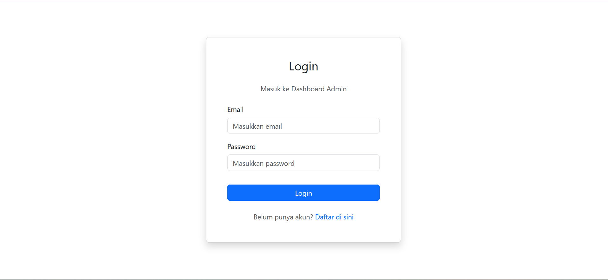
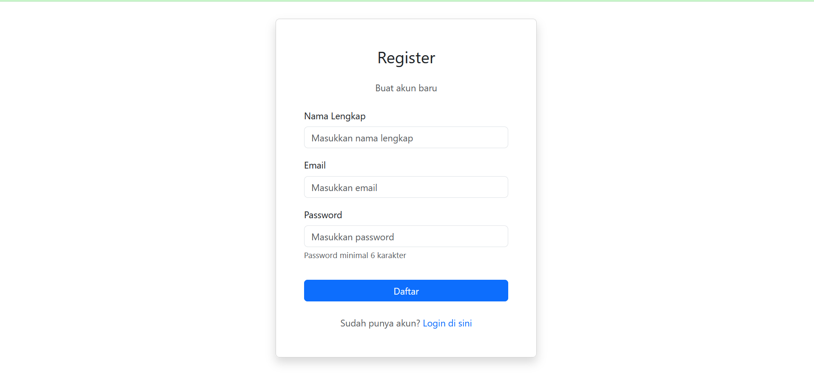
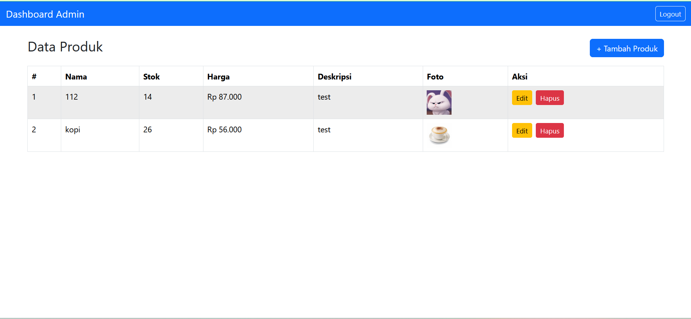
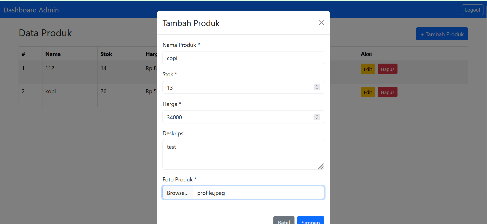
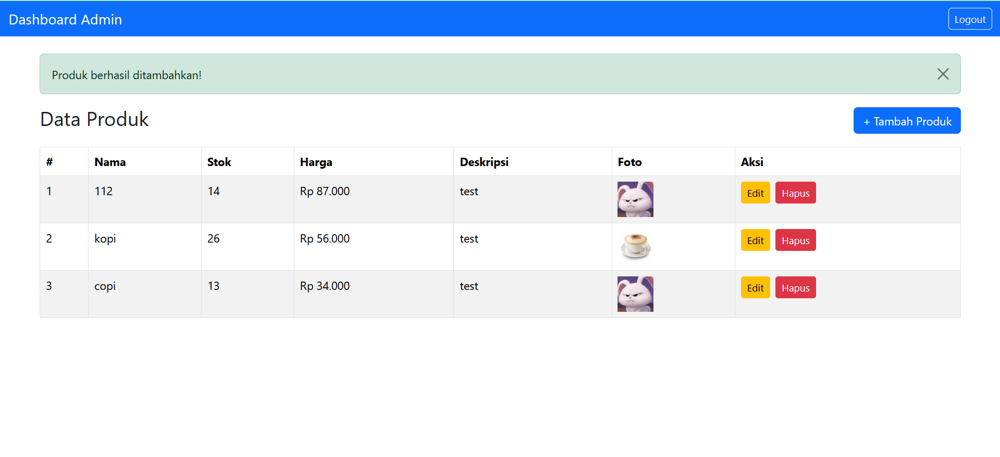
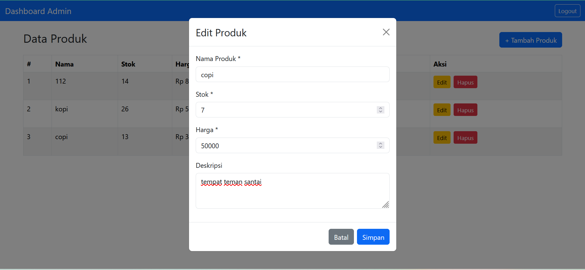
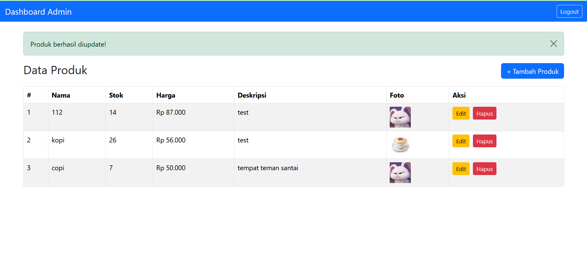

# Tugas: Asynchronous 4 - Front-End Development Part 2

Aplikasi web CRUD (Create, Read, Update, Delete) untuk manajemen produk dengan sistem autentikasi menggunakan JWT (JSON Web Token). Dibangun menggunakan React.js, React Bootstrap, dan Axios.

## 📋 Deskripsi Singkat

Aplikasi ini adalah sistem manajemen produk sederhana yang memiliki fitur autentikasi (register & login) dan CRUD lengkap untuk data produk. Setiap user harus login terlebih dahulu untuk mengakses dashboard dan melakukan operasi CRUD.

## ✨ Fitur

- 🔐 **Autentikasi User**
  - Register akun baru
  - Login dengan JWT Token
  - Protected Routes
  - Auto logout saat token expired

- 📦 **CRUD Produk**
  - Create: Tambah produk baru dengan upload foto
  - Read: Tampilkan semua produk dalam tabel
  - Update: Edit data produk
  - Delete: Hapus produk dengan konfirmasi

- 🎨 **User Interface**
  - Responsive design menggunakan React Bootstrap
  - Modal untuk form input
  - Alert notifikasi sukses/error
  - Loading state
  - Preview foto produk

## 🛠️ Tech Stack

- **React.js** v19.2.0 - Frontend framework
- **React Router DOM** v7.9.5 - Routing
- **React Bootstrap** v2.10.10 - UI components
- **Bootstrap** v5.3.8 - CSS framework
- **Axios** v1.13.1 - HTTP client
- **React Scripts** v5.0.1 - Build tools

## 📦 Persyaratan Aplikasi

Sebelum menjalankan aplikasi, pastikan Anda sudah menginstall:

- **Node.js** versi 14.x atau lebih tinggi
- **npm** 
- **Backend API** sudah berjalan di `http://localhost:5000`

## 🚀 How to Use / Installation dan Cara Build

### 1. Clone Repository

```bash
git clone https://github.com/lomanto215/latihan-frontend.git
cd latihan-frontend
```

### 2. Install Dependencies

```bash
npm install
```

### 3. Konfigurasi Backend URL

Pastikan file `src/api/api.js` sudah mengarah ke backend URL yang benar:

```javascript
const api = axios.create({
  baseURL: 'http://localhost:5000', 
});
```

### 4. Jalankan Aplikasi (Development Mode)

```bash
npm start
```

Aplikasi akan berjalan di `http://localhost:3000`

### 5. Build untuk Production

```bash
npm run build
```

File production akan tersimpan di folder `build/`

## 📁 Struktur Project

```
latihan-frontend/
├── public/
│   ├── index.html
│   └── favicon.ico
├── src/
│   ├── api/
│   │   └── api.js                 # Konfigurasi Axios
│   ├── components/
│   │   └── PrivateRoute.js        # Protected Route Component
│   ├── pages/
│   │   ├── Login.js               # Halaman Login
│   │   ├── Register.js            # Halaman Register
│   │   └── Dashboard.js           # Halaman Dashboard CRUD
│   ├── App.js                     # Main App Component
│   ├── index.js                   # Entry Point
│   └── index.css                  # Global Styles
├── package.json
├── .gitignore
└── README.md
```

## 🎯 Cara Penggunaan

### 1. Register Akun
- Buka `http://localhost:3000/register`
- Isi form: Nama Lengkap, Email, Password
- Klik tombol **Daftar**

### 2. Login
- Buka `http://localhost:3000/login`
- Isi Email dan Password
- Klik tombol **Login**
- Anda akan diarahkan ke Dashboard

### 3. Tambah Produk
- Di Dashboard, klik tombol **+ Tambah Produk**
- Isi form: Nama Produk, Stok, Harga, Deskripsi
- Upload foto produk (JPG/PNG, max 2MB)
- Klik **Simpan**

### 4. Edit Produk
- Klik tombol **Edit** pada produk yang ingin diubah
- Ubah data yang diperlukan
- Klik **Simpan**

### 5. Hapus Produk
- Klik tombol **Hapus** pada produk yang ingin dihapus
- Konfirmasi penghapusan
- Produk akan terhapus dari database

### 6. Logout
- Klik tombol **Logout** di navbar
- Anda akan kembali ke halaman login

## 🔗 Related Project

**Backend Repository:** [https://github.com/lomanto215/backend](https://github.com/lomanto215/backend)

Backend API diperlukan untuk menjalankan aplikasi ini. Pastikan backend sudah berjalan sebelum menjalankan frontend.

## Introduction Our Team / Contributing

Proyek ini dibuat oleh:
- **Nama:** [Nama Anda]
- **NIM:** [NIM Anda]
- **Kelas:** [Kelas Anda]
- **Mata Kuliah:** Pemrograman Asynchronous


## Screenshots

### 1. Halaman Login


### 2. Halaman Register


### 3. Dashboard - List Produk


### 4. Form Tambah Produk



### 5. Form Edit Produk




## Contact

Jika ada pertanyaan, silakan hubungi:
- **Email:** [triasajilomanto215@gmail.com]
- **GitHub:** [@lomanto215](https://github.com/lomanto215)

---

**Trias Aji Lomanto 2025**